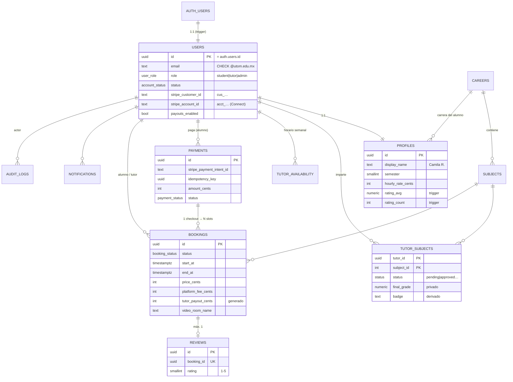

# EduConnect — Módulo 2: Modelo de Datos y Seguridad en Base de Datos

Scripts ejecutables en `supabase/migrations/` (aplicar en orden con `supabase db push`):

| Archivo | Contenido |
|---|---|
| `20260929000001_schema.sql` | Tipos, 12 tablas, constraints, triggers, hook JWT, helpers de autorización, vistas `tutor_cards` y `subject_tutor_counts` |
| `20260929000002_rls.sql` | *Deny by default*, privilegios por columna, RLS en todas las tablas, Realtime |
| `20260929000003_seed_catalog.sql` | Carreras y materias del diseño Figma |
| `20260929000004_storage.sql` | Buckets `avatars` (público) y `tutor-evidence` (privado) + políticas |
| `20260929000005_jobs.sql` | Expiración de holds de 15 min con `pg_cron` |
| `20260929000006_checkout_rpc.sql` | RPC atómica `create_checkout` (Módulo 3) + columna `late_cancellation` |
| `tests/02_checkout_tests.sql` | 10 pruebas del checkout (precio de BD, idempotencia, rollback, disponibilidad) |
| `tests/01_rls_tests.sql` | **54 pruebas de seguridad** (dominio, RBAC, RLS, IDOR, integridad) — 54/54 PASS en PostgreSQL 16 |

---

## 1. Diagrama entidad-relación



### Por qué `users` y `profiles` están separadas

`users` guarda **datos de seguridad** (email, rol, estado, IDs de Stripe): solo la ve el propio usuario y los admins, y ningún cliente puede escribirla. `profiles` guarda **datos de presentación** que aparecen en la TutorCard. Separarlas permite que la RLS de una sea estricta sin romper el catálogo público.

---

## 2. Decisiones de integridad (defensa en la base de datos)

| Regla de negocio | Cómo se garantiza | Por qué en BD y no solo en el API |
|---|---|---|
| Solo correos `@utom.edu.mx` | Trigger `BEFORE INSERT` en `auth.users` + `CHECK` en `public.users`. Regex anclada: rechaza `@utom.edu.mx.attacker.com` y subdominios | Cubre registro por email, magic link **y** OAuth; nadie puede saltárselo llamando a Supabase Auth directamente |
| Todo usuario nace `student` | El trigger de alta ignora `raw_user_meta_data.role` (controlable por el cliente) | Evita escalamiento vía `signUp({ data: { role: 'admin' } })` |
| Sin dobles reservas | `EXCLUDE USING gist (tutor_id WITH =, tstzrange(start_at,end_at) WITH &&)` para tutor **y** alumno, solo en estados activos | Dos checkouts simultáneos del mismo slot: el segundo falla de forma atómica, sin condiciones de carrera |
| Solo se reserva con tutor aprobado en la materia | Trigger `booking_integrity` | Aunque el API tenga un bug, la BD no acepta la fila |
| Badge "Passed with Excellence" real | `badge` es columna **generada** desde `final_grade` verificada (≥ 9.5 excelencia, ≥ 9.0 honor roll); `CHECK` exige `verified_by` para aprobar | El tutor no puede autodeclararlo |
| Rating no manipulable | `rating_avg/rating_count` solo los escribe un trigger; el `GRANT UPDATE` por columna no los incluye | Un `UPDATE profiles SET rating_avg = 5` falla con *permission denied* |
| Reseña solo tras sesión completada, 1 por reserva | Trigger copia `student_id/tutor_id` desde la reserva + `UNIQUE(booking_id)` + política `WITH CHECK student_id = auth.uid()` | Impide reseñas falsas o de terceros |
| Dinero exacto | `integer` en centavos, `tutor_payout_cents` generado, `refunded_cents ≤ amount_cents` | Sin errores de redondeo ni reembolsos mayores al cobro |
| Cero datos de tarjeta (PCI-DSS) | No existe ninguna columna para PAN/CVV/vencimiento; solo IDs opacos `pi_`, `ch_`, `cus_`, `acct_`, `tr_` validados por regex | El alcance PCI queda en SAQ-A (Stripe Elements) |
| Tokens de video nunca persistidos | Solo `video_room_name`; el token se emite por petición y expira | Una fuga de BD no da acceso a aulas |
| Bitácora inalterable | Trigger bloquea `UPDATE/DELETE` en `audit_logs` (incluso para `service_role`) | Trazabilidad forense |

---

## 3. Modelo de autorización

### 3.1 Tres capas

1. **Privilegios de Postgres (`GRANT`)**: qué tablas **y columnas** puede tocar cada rol de conexión. Se parte de `REVOKE ALL` (Supabase concede todo por defecto) y se otorga lo mínimo.
2. **RLS**: qué **filas**. Habilitada en las 12 tablas.
3. **Rol de negocio** (`student|tutor|admin`) en `public.users.role`, evaluado con helpers `SECURITY DEFINER` en el esquema `private` (no expuesto por la API REST). Se lee de la tabla, no del JWT, para que una suspensión o degradación sea **inmediata**. El JWT lleva `user_role` (vía *Custom Access Token Hook*) solo para que la UI muestre u oculte opciones.

### 3.2 Matriz de permisos (cliente con JWT)

| Tabla | Alumno | Tutor | Admin | Anónimo | Backend (`service_role`) |
|---|---|---|---|---|---|
| `users` | R (propia) | R (propia) | R (todas) | — | CRUD |
| `profiles` | R (propia, tutores listados, contrapartes) · U propia (columnas permitidas, sin tarifa) | igual + U tarifa | R todas | — | CRUD |
| `careers` / `subjects` | R activas | R activas | R todas · C/U | R activas | CRUD |
| `tutor_subjects` | R aprobadas (sin calificación ni evidencia) · C solicitud propia `pending` | igual + R propias | R | — | CRUD (aprobación con auditoría) |
| `tutor_availability` | R de tutores listados | CRUD propia | R | — | CRUD |
| `bookings` | R donde es alumno | R donde es tutor | R todas | — | CRUD |
| `payments` | R propios | — (ve su payout en `bookings`) | R | — | CRUD |
| `reviews` | R visibles · C propia (sesión completada) | R visibles | R todas · U `is_hidden` | — | CRUD |
| `notifications` | R propias · U `read_at` | igual | igual | — | CRUD |
| `stripe_events` | — | — | — | — | CRUD |
| `audit_logs` | — | — | R | — | C (append-only) |

*R = leer, C = crear, U = actualizar, D = borrar.* Cualquier cuenta con `status ≠ active` pierde el acceso de lectura en todas las tablas sensibles.

### 3.3 Por qué las reservas y pagos no se escriben desde el cliente

Si el alumno pudiera hacer `INSERT` en `bookings`, podría elegir `price_cents = 1` o marcar `status = 'confirmed'` sin pagar. Por eso el cliente solo tiene `SELECT`; el API calcula precio y comisión, crea el `PaymentIntent` y solo el webhook firmado de Stripe cambia el estado.

---

## 4. Resultado de las pruebas

Ejecutadas sobre PostgreSQL 16 con un stub de `auth`/`storage` de Supabase (`tests/00_supabase_stub.sql`):

```
54 passed | 0 failed
```

Casos cubiertos: rechazo de dominios externos y sufijos falsos · rol inyectado en metadata ignorado · alumno no se hace admin · tutor no infla su rating · alumno no fija tarifa · calificación del kárdex no legible · cliente no crea reservas · slot traslapado rechazado · reserva de materia no aprobada rechazada · auto-reserva rechazada · anti-IDOR en reservas, pagos y perfiles · reseña antes de completar / de terceros / duplicada rechazadas · rating recalculado · notificaciones aisladas · disponibilidad traslapada rechazada · evidencia en carpeta ajena rechazada · logs inmutables · hook JWT no invocable como RPC · cuenta suspendida sin acceso · expiración de holds.

Durante las pruebas se detectó y corrigió un defecto: la política de lectura del catálogo para `anon` invocaba un helper de admin sin permiso de ejecución (habría roto la landing). Se separó en políticas por rol.

---

## 5. Configuración de Supabase complementaria (Dashboard)

| Ajuste | Valor |
|---|---|
| Authentication → Hooks → Custom Access Token | `public.custom_access_token_hook` |
| Authentication → Email → Confirm email | **Activado** |
| Contraseñas | mínimo 12 caracteres, letras + dígitos + símbolos, **Leaked password protection** (HIBP) activado |
| Bot & Abuse Protection | CAPTCHA (Cloudflare Turnstile) en signup, login y recuperación |
| Rate limits de Auth | Ajustar límites de sign-in/sign-up y envío de correos por hora |
| JWT expiry | 3600 s · Refresh token rotation + reuse detection activados |
| MFA | TOTP habilitado; obligatorio para admins (verificado en el API con `aal2`) |
| API → Exposed schemas | Solo `public` (nunca `private`) |
| Database → SSL enforcement | **Activado** · Network restrictions: IPs de Render |
| Point-in-Time Recovery | Activado en producción |
| Extensiones | `btree_gist`, `pg_trgm`, `pg_cron` |
